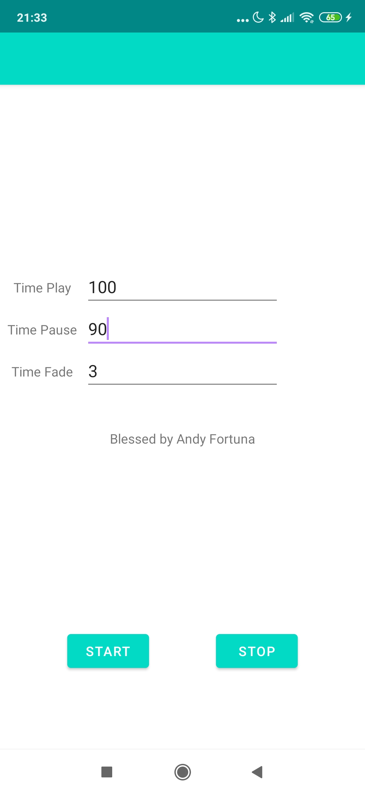

# FinalDance

Simple app to do a timed replay of a running spotify instance. Developed to be used when dancing finals, where a song is play 90 seconds, then paused for 30 seconds, then the next song is played.

## How to use
Download the Android Spotify SDK (I used version 0.7.1 of Spotify App Remote Release). Build with Android studio
and upload app to your device. On the phone, the Spotify App must be open and running in the background. 

The app has three fields, Time Play, Time Pause, Time Fade. A song is played for Time Play time, then faded out over Time Fade and then paused for Time Pause, until the next song starts playing in the play list. Start then starts the current song from the beginning.

The app will continue to control the playback until you press stop or close it. It will also control your System Audio Level to implement fadeout, so beware!

Example screenshot:

